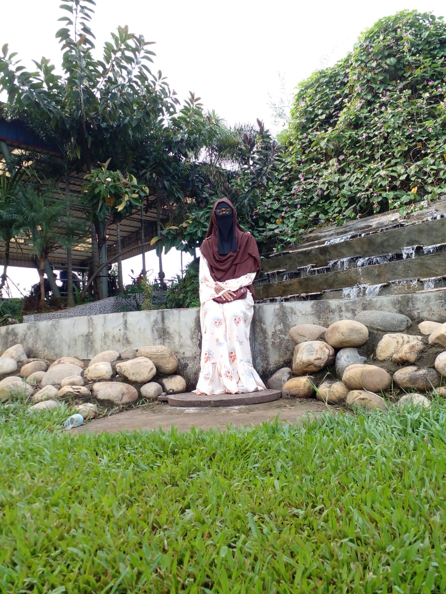

---
# title: Curriculum Vitae
summary: This is my Curriculum Vitae.
date: 2024-11-18
type: docs
math: false
# tags:
# - Curriculum Vitae
# image:
#   caption: ' '
---

  
  

    <h1>Ummatun Khatun</h1>
    
Studies at Department of Computer Science & Engineering in Jahangirnagar University

  

## Profile Summary
Ummatun Khatun is a Computer Science & Engineering student at Jahangirnagar University with a passion for robotics, web development, and artificial intelligence. As a member of the Jahangirnagar University Robotics Club, she has contributed to innovative projects like line-following robots, maze-solving algorithms, and robotic arms

---

## Education

- **Jahangirnagar University** 
  
  *Bachelor’s Degree*  
  Year of Graduation: 2022-present

- **Al Helal Islami Academy and College**
  *HSC*  
  GPA: 5.00  
  Graduated: 2020

- **Al Helal Islami Academy and College** 
  *SSC*
  GPA: 5.00  
  Graduated: 2018

---

## Skills

- **Languages**: HTML, CSS, Java, C, C++
- **Frameworks**: React, Bootstrap
- **Tools**: Git, GitHub, VS Code, Figma, Paradigm
- **Other**: Responsive Web Design

---

<!-- ## Professional Experience

- **[Current/Most Recent Company/Organization Name]**  
  *Front-End Developer*  
  [Employment Duration]  
  - Developed and maintained responsive websites and applications.
  - Collaborated with designers and back-end developers to create seamless user experiences.
  - Improved website performance and ensured cross-browser compatibility.
  - Implemented new features and optimized existing code. -->

## Projects

<!-- - **[Portfolio Website]**: Developed a personal portfolio website showcasing projects, skills, and experience. -->
- **[Web Development Projects]**:

-Tic-Tac-Toe

-Tribute page

-Accessibility Building Page

-Technical Documntation

- **[Robotics Project]**:

-Line Following Robot (LFR)

-Robo Soccer

-Maze Solve

---

## Additional Experience

- **Teaching**: Provided private tuition and conducted classes at school, gaining experience in helping students understand complex concepts effectively.

---

## Certifications

- **FreeCodeCamp**: Responsive Web Design Certification
- **Buet Robotics Society**: Robotics Competition
- **Science Curnival 3.0**: Chattogram University Robot Competition
- **Technoxian Bangladesh**: 1st Technoxian Bangladesh National Round-2024

---
## Contact Me

Email: ummatunkhatun086@gmail.com

GitHub: https://github.com/ummatun

Phone: 01787305158

Location: Savar,Dhaka

---
